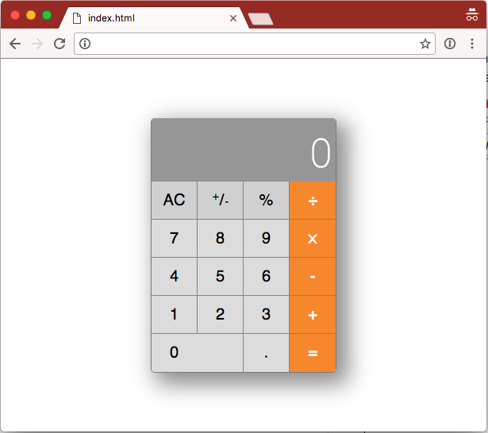

# Calculator Benchmark

- Do this goal solo
- Start from scratch
- Do as much as you can
- Do not use any unmentioned frameworks
- Do not look at other solutions to this goal
- Understand and write every line of code
- Ask for coaching sessions
- Do not let coaches write code for you
- Get frequent code reviews
- Never copy and paste code from the Internet. Always type it out.

## Specs

The specs for this goal are far too numerous to complete within a week. Do not expect to get everything done but try to get as much done as you can.

This goal has 5 linear stages. You must complete the specs of each stage before progressing onto the next. The number of stages you complete will be the result of your self assessment, so keep track of how far you get, and aim to get farther next time.

**IMPORTANT:** When you complete a stage, before moving onto the next stage, tag the commit that completes stage N as `stage-N-complete` using [`git tag`](https://git-scm.com/book/en/v2/Git-Basics-Tagging). *Don't forget to push with `--tags`*.

### Stage 1

In stage 1 you will only be using `HTML` and `CSS` to build a clone of the OS X calculator interface. You're only building the interface in this stage. You'll make the calculator work in stage 2.

##### In this stage you will be using at least the following skills:

- HTML/CSS positioning
- CSS text/type styling
- Web Fonts
- Proper HTML formatting
- Proper CSS formatting
- Proper DOM positioning of assets
- Positioning with `inline`, `block` and `inline-block`
- CSS pseudo-selectors
- CSS transitions
- Chrome Developer Tools Element tab

##### During this phase you should…

- Use [normalize.css](https://necolas.github.io/normalize.css/)
- NOT use any other css frameworks or libraries
- NOT use tables
- NOT use any JavaScript
- NOT use an express server
- NOT use images
- NOT use `<form>` tags
- NOT use `<input>` tags

##### Specs

- [ ] All text is in the [Roboto](https://fonts.google.com/specimen/Roboto) web font
- [ ] Your `HTML` and `CSS` follows this [style guide](https://google.github.io/styleguide/htmlcssguide.xml)
- [ ] The calculator is positioned in the center of the page, both vertically and horizontally
- [ ] If the window is too small for the calculator, the page scrolls
- [ ] Each button has a CSS transition to slightly darken the background color on hover over 100ms
- [ ] Each button has a CSS transition to slightly darken the background color on click over 100ms
- [ ] All class names re: the calculator are name-spaced under `.calculator-…`
- [ ] Your stylesheet contains little to no duplicate style declarations

### Stage 2

In stage 2 you will be adding `JavaScript` to make the calculator work.

##### In this stage you will be using at least the following skills:

- ES5 syntax
- Registering event listeners
- Binding to the DOM Ready event
- JavaScript closures
- JavaScript callbacks
- JavaScript formatting
- Event Delegation
- Event bubbling
- Querying the DOM API
- Manipulating the DOM using the DOM API
- Avoiding using the DOM for state

##### During this phase you should…

- NOT use `jQuery` or any other `JavaScript` libraries or frameworks

##### Specs

- [ ] Your `JavaScript` is written in `ES5`
- [ ] Your `JavaScript` follows this [style guide](https://google.github.io/styleguide/jsguide.html)
- [ ] The Calculator display is not an `<input>`
- [ ] Typing a relevant key at any point is reflected by the calculator
- [ ] Typing a relevant key causes the corresponding button on the calculator to appear to have been pressed. AKA flashes active
- [ ] The state of the calculator is not be stored in the `DOM`
- [ ] The mathematical operations for your calculator are each their own .function, and are defined outside of any click handler
- [ ] When the length of the number displayed exceeds the width available, the font-size deterministically drops
- [ ] Your JavaScript defines 1 or less global variables

### Stage 3

In stage 3 you are going to add a second calculator to the page. Both calculators will be exactly the same but work independently. This will likely require you to refactor some of the JavaScript you wrote in stage 2.

##### In this stage you will be using at least the following skills:

- Event delegation
- JavaScript Constructors
- Componentization
- Composition

##### During this phase you should…

- NOT use `jQuery` or any other `JavaScript` libraries or frameworks

##### Specs

- [ ] Each calculator should act independently.
- [ ] Clicking anywhere on a calculator focuses that calculator.
- [ ] Typing a relevant key should affect the focused calculator.
- [ ] Use event delegation to avoid binding a `click` event listener to each button
- [ ] The focused calculator should be `opacity: 1`
- [ ] The not-focused calculator should be `opacity: 0.5`

### Stage 4

In stage 4 you are going to move the work of your calculator to the server. This might seem silly but its a good way to practice moving logic from the browser to the server without the logic itself being too complex.

##### In this stage you will be using at least the following skills:

- Setting up a simple Node express server
- XHR / AJAX requests
- Sending conventional HTTP status codes
- Using conventional HTTP verbs
- Setting common HTTP headers
- rendering JSON from express
- Following the RESTful routes convention

##### During this phase you should…

- initialize a node `package.json`
- use `express`
- use a JSON body parser
- NOT use any other node packages

##### Specs

- [ ] Each mathematical operation is done on the server
- [ ] Each request for a mathematical operation is a `post` request
- [ ] Each operation request responds with `JSON`
- [ ] When the calculator is waiting for an operation to complete, it ignored all input

### Stage 5

In stage 5 you are going to add authentication to your express server.

